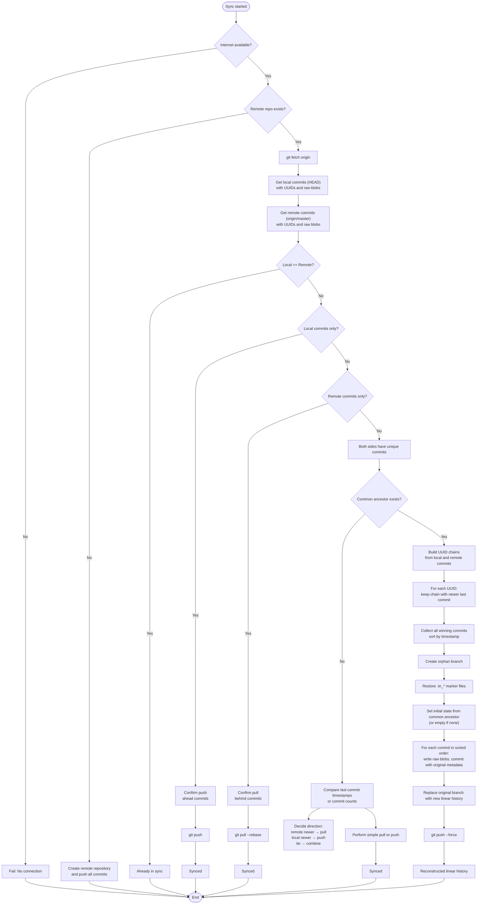

You are correct. The document should explicitly mention that because the synchronisation system works with any standard Git remote, it provides **free, encrypted sync** using public hosting platforms such as GitHub, GitLab, Bitbucket, or any self‑hosted Git server. This is a significant advantage derived from the architecture, not an add‑on feature.

Here is the revised Section 6 (Observable Behaviour) with the addition, and a corresponding note in the Introduction and Prior Art Assertion.
# Prior Art Disclosure: Deterministic Item‑Level Git Synchronisation

## A Technical Description of UUID‑Based, Encrypted, Merge‑Free History Reconstruction

---

**Date of Disclosure:** May 2026  
**Author:** sys_ronin  
**Status:** Public, Timestamped, Irrevocable  
**Repository:** github.com/sys-ronin/terminal-notes  

---

## Table of Contents

1. Introduction  
2. Core Components and Properties  
   2.1 UUID as Permanent Item Identifier  
   2.2 Three‑JSON Architecture  
   2.3 Encryption Before Git (Stream Cipher)  
   2.4 Commit Granularity  
   2.5 Git Delta Compression on Encrypted Blobs  
3. Synchronisation Algorithm (Observable Behaviour)  
   3.1 Gathering Commits  
   3.2 Grouping by UUID  
   3.3 Conflict Resolution (Deterministic)  
   3.4 Merging Winning Chains  
   3.5 History Reconstruction on Orphan Branch  
   3.6 Replacing the Original Branch  
4. Complete Flowchart of All Sync Possibilities  
5. Why the Algorithm Is Possible  
   5.1 Item‑Isolating Data Model  
   5.2 Stream Cipher Encryption  
   5.3 UUID in Commit Messages  
   5.4 Complete Snapshot Strategy  
   5.5 Deterministic Timestamp Rule  
6. Observable Behaviour (No Claim)  
7. Prior Art Assertion  
8. Conclusion  

---

## 1. Introduction

This document describes a synchronisation system for Git‑backed, encrypted, hierarchical data. The system operates entirely at the item level, where each item (note, file, subnotebook) is identified by a permanent UUID. Data is stored in three JSON files (`structure.json`, `notes.json`, `files.json`), each encrypted with a stream cipher (AES‑256‑GCM in counter mode) before being written to Git.

The synchronisation process does not rely on Git’s built‑in merge or rebase. Instead, it collects all commits from local and remote branches, groups them by UUID, and for each UUID keeps the chain whose last commit is newer (deterministic timestamp comparison). Winning commits are merged, sorted by timestamp, and replayed on an orphan branch to produce a linear history. The result is a single, straight timeline with no merge commits. The user never needs to know Git.

Because the synchronisation operates on standard Git remotes, the encrypted notebook data can be pushed to any Git hosting platform – GitHub, GitLab, Bitbucket, or a self‑hosted Gitea instance – without exposing content. No separate sync service, subscription, or proprietary cloud is required.

The purpose of this disclosure is to establish prior art for the concepts described herein. No claim of novelty is made; the description is based on observable behaviour of a working implementation.

---

## 2. Core Components and Their Properties

### 2.1 UUID as Permanent Item Identifier

Every note, file, and subnotebook receives a UUID at creation. The UUID never changes. It is stored in:

- `structure.json` as part of the item’s metadata.
- `notes.json` or `files.json` as the dictionary key for content.
- Every Git commit message that affects the item (via the `uuid:` metadata field).

Thus, the UUID serves as a **stable foreign key** that can be used to group commits across different branches.

### 2.2 Three‑JSON Architecture

The system maintains three separate JSON files per notebook:

- `structure.json` – hierarchy, parent‑child relationships, item metadata (title, timestamps, file extensions).  
- `notes.json` – a dictionary mapping note UUIDs to their plaintext content (encrypted before write).  
- `files.json` – a dictionary mapping file UUIDs to their binary content (encrypted before write).

Because each item occupies a single key‑value pair, editing one item changes only a small, contiguous region of the corresponding JSON file. This property is essential for both storage efficiency and surgical conflict resolution.

### 2.3 Encryption Before Git (Stream Cipher)

All JSON files are encrypted **before** they are written to the working directory or staged for commit. The encryption uses AES‑256‑GCM in counter mode (CTR). For a fixed (key, nonce) pair:

- The ciphertext is generated by XOR‑ing the plaintext with a keystream derived from the key and nonce.
- The encryption is deterministic: the same plaintext at the same position produces the same ciphertext.
- A small change in plaintext (e.g., modifying one key‑value pair) affects **only the corresponding ciphertext bytes**; the rest of the encrypted file remains identical.

Thus, when the system edits a single note, the encrypted `notes.json` blob differs from its previous version **only in a small, contiguous binary region**.

### 2.4 Commit Granularity

Every user operation (create, edit, delete, rename) results in a Git commit that changes **exactly one UUID** (or a small, constant number). The commit message contains the UUID and the action type (`CREATED`, `UPDATED`, `DELETED`, `RENAMED`, `RESTORED`, `ERASED`). This makes each commit **item‑addressable** and independent of other items.

### 2.5 Git Delta Compression on Encrypted Blobs

Git stores objects (blobs) in packfiles using the `xdelta` algorithm, which identifies regions of similarity between two binary blobs and stores only the differences.

Because the encrypted blob of `notes.json` changes only in a small localised region after a single‑note edit (Section 2.3), Git’s delta compression sees two highly similar binary blobs. It therefore stores a compact delta (a few hundred bytes) instead of a full copy of the entire encrypted file. This holds true even though the blob is encrypted and appears as high‑entropy noise – the difference between the two blobs is localised and small.

Consequently, the repository size grows proportionally to the number of changes, not to the size of the encrypted files multiplied by the number of commits. This property is critical for the long‑term viability of the system.

---

## 3. Synchronisation Algorithm (Observable Behaviour)

### 3.1 Gathering Commits

For a given branch (e.g., `HEAD` and `origin/master`), the system runs:

```bash
git rev-list --no-merges <ref>
```

For each commit hash, it extracts:

- The raw binary blob of `notes.json`, `files.json`, and `structure.json` (via `git show <hash>:<file>`).
- The UUID from the commit message (using regex patterns).
- The timestamp, author, and full commit message.

Merge commits are ignored because the system never creates them.

### 3.2 Grouping by UUID

All collected commits are grouped by the extracted UUID. Each UUID now has a **chain** of commits in chronological order (the commits that touched that specific item). Because each commit changes exactly one UUID (Section 2.4), the chains are disjoint – a commit belongs to exactly one UUID’s chain.

### 3.3 Conflict Resolution (Deterministic)

For each UUID, the system compares the local chain and the remote chain:

- If only one side has commits, that chain is kept.
- If both sides have commits, the **last commit timestamp** of each chain is compared. The chain whose last commit has a newer timestamp is kept; the other chain is discarded entirely.

No content analysis is performed. The decision is based solely on commit timestamps. This is a deterministic, automatic rule that requires no user intervention. It is appropriate for a single‑writer, multi‑device scenario, where the most recent change (by timestamp) should be the final state.

### 3.4 Merging Winning Chains

All winning commits (from all UUIDs) are collected into a single list and sorted by their original timestamp (ascending). This produces a **linear sequence of commits** that respects the original order in which changes were made, independent of branch topology. Commits from local and remote are interleaved according to their timestamps.

### 3.5 History Reconstruction on Orphan Branch

A new orphan branch is created (`git checkout --orphan`). The system restores encryption marker files (`.tn_test`, `.tn_recovery`, `.tn_password`) from backup. If a common ancestor exists, the initial state is set to that commit’s blobs. Otherwise, the initial state is empty.

Then, for each commit in the sorted winning list, the system:

- Writes the raw binary blobs (`notes.json`, `files.json`, `structure.json`) to the working tree (overwriting the previous versions).
- Stages the changes and commits with the original author, timestamp, and commit message (using `GIT_AUTHOR_DATE`, `GIT_COMMITTER_DATE` environment variables).

Because each commit is a **complete snapshot** of the three encrypted files, this replay simply copies bytes; no parsing, decryption, or content merging is needed.

### 3.6 Replacing the Original Branch

After reconstruction, the orphan branch is renamed to the original branch name (e.g., `master`), replacing the old history. The branch is then force‑pushed to the remote (`git push --force`). The result is a **linear, merge‑commit‑free history** that contains all winning commits from both sides, ordered by their original timestamps.

---

## 4. Complete Flowchart of All Sync Possibilities



This flowchart covers all observable sync cases: already in sync, local‑only commits, remote‑only commits, diverged histories with a common ancestor (leading to UUID chain resolution and linear reconstruction), and diverged histories without a common ancestor (fallback to timestamp comparison and simple pull/push).

---

## 5. Why the Algorithm Is Possible

### 5.1 Item‑Isolating Data Model

The three‑JSON architecture ensures that each item’s data is physically separate from others. Editing one note changes only one key‑value pair in `notes.json` and (optionally) one object in `structure.json`. This isolation is the precondition for per‑UUID grouping and independent conflict resolution.

### 5.2 Stream Cipher Encryption

Because AES‑256‑GCM in CTR mode produces a ciphertext change proportional to the plaintext change, the encrypted blob after a single‑note edit differs from its predecessor only in a small localised region. This directly enables Git’s delta compression to work efficiently (Section 2.5).

### 5.3 UUID in Commit Messages

Embedding the UUID in the commit message allows the system to **group commits by item** without parsing or decrypting the file content. The commit message is the only plaintext metadata in the repository.

### 5.4 Complete Snapshot Strategy

Each commit contains a full copy of the three encrypted JSON files. This means reconstruction can be performed by simple binary copy. No merge of file contents is required. The algorithm only needs to decide **which** snapshot to use for each UUID chain, not **how** to combine conflicting changes within a file.

### 5.5 Deterministic Timestamp Rule

The algorithm assumes that commit timestamps are reliable and that users do not tamper with system clocks. For a single‑writer, multi‑device scenario, this assumption is reasonable. The rule “newer chain wins” provides a simple, automatic, and predictable outcome.

---

## 6. Observable Behaviour (No Claim)

- **No merge commits** ever appear in the repository history.
- **History is linear** after every sync (a single straight line of commits ordered by timestamp).
- **Conflicts are resolved automatically**; the user only sees a confirmation prompt describing what will happen.
- **Encrypted blobs remain encrypted** throughout the process; the sync engine never decrypts them.
- **Marker files (`.tn_*`)** are preserved across history rewrites.
- **Subnotebook hierarchies** are recursively merged because the reconstruction replays the entire structure snapshot.
- **Free, encrypted sync with any Git remote** – the system pushes encrypted binary blobs to any standard Git server (GitHub, GitLab, Bitbucket, self‑hosted). No separate sync service, no subscription fees, and no vendor lock‑in. The hosting provider never sees plaintext content.

---

## 7. Prior Art Assertion

This document establishes prior art for the following concepts, all of which are implemented and observable in the accompanying source code as of May 2026:

1. **Per‑UUID commit grouping** – collecting commits based on UUID extracted from commit messages.
2. **Deterministic conflict resolution by timestamp** – keeping the chain whose last commit is newer, discarding the other.
3. **Linear history reconstruction without merge commits** – replaying winning commits on an orphan branch and replacing the original branch.
4. **Encrypted binary blob handling** – working with raw encrypted blobs, never decrypting during sync.
5. **Item‑level commit granularity** – each commit changes exactly one UUID (or a small constant number).
6. **Three‑JSON architecture as enabler** – isolating items into separate key‑value pairs to enable surgical binary changes.
7. **Stream cipher encryption for efficient Git deltas** – using AES‑GCM in CTR mode to produce localised ciphertext changes.
8. **Complete snapshot replay** – reconstructing history by copying whole encrypted blobs, not by merging content.
9. **Zero‑Git‑knowledge user interface** – sync triggered by a single confirmation, all Git details hidden.
10. **Handling of no common ancestor** – fallback to timestamp and commit count comparison when merge‑base is absent.
11. **Free, encrypted sync via any Git remote** – using standard Git remotes (GitHub, GitLab, Bitbucket, self‑hosted) as encrypted storage backends, with no separate sync service required.

These concepts are described in public, timestamped documents and source code as of May 2026. They constitute prior art under:

- **35 U.S.C. § 102(a)(1)** (United States) – A person is entitled to a patent unless the invention was patented, described in a printed publication, or in public use, on sale, or otherwise available to the public before the effective filing date.
- **EPC Article 54(2)** (European Patent Convention) – The state of the art shall be held to comprise everything made available to the public before the date of filing of the European patent application.
- **EPO Enlarged Board of Appeal Decision G 1/23 (2 July 2025)** – Public availability alone is sufficient for prior art; no requirement of reproducibility applies.

No party may obtain valid patent claims covering any concept disclosed herein in any jurisdiction.

The system is released under the **Eternal License**, which explicitly prohibits patenting any disclosed concept and asserts that the technology belongs to no one.

---

## 8. Conclusion

This document describes a synchronisation system that operates at the item level (UUID), uses encrypted binary blobs, resolves conflicts automatically by comparing timestamps, and reconstructs a perfectly linear history without merge commits. The system is implemented and used daily. The description is based on observable code behaviour, not on theoretical speculation.

The enabling factors are: the three‑JSON architecture, stream cipher encryption, UUIDs in commit messages, and Git’s binary delta compression. Together, they allow a deterministic, user‑transparent sync engine that requires no knowledge of Git.

This disclosure is made in the public interest. It may be cited in any patent examination, litigation, or prior art search.

---

**sys_ronin**  
May 2026  
sys_ronin@protonmail.com  
github.com/sys-ronin/terminal-notes
```
