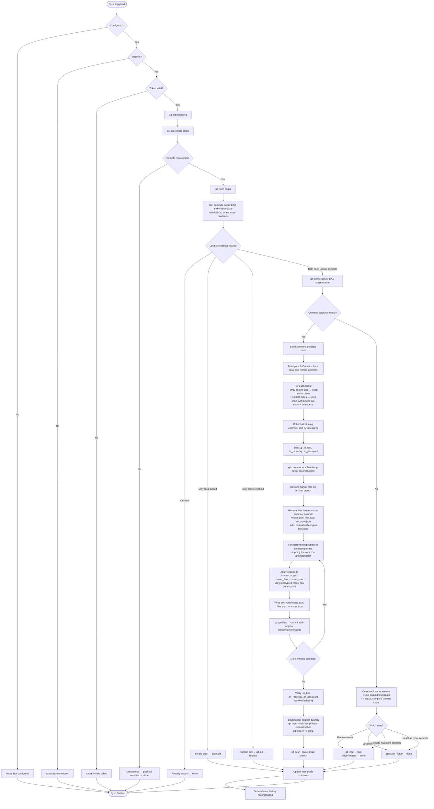

# Prior Art Disclosure: Deterministic Item‑Level Git Synchronisation

## A Technical Description of UUID‑Based, Encrypted, Merge‑Free History Reconstruction

---

**Date of Disclosure:** May 2026  
**Author:** sys_ronin  
**Status:** Public, Timestamped, Irrevocable  
**Repository:** github.com/sys-ronin/terminal-notes  

---

## Table of Contents

1. Introduction  
2. Core Components and Properties  
   2.1 UUID as Permanent Item Identifier  
   2.2 Three‑JSON Architecture  
   2.3 Encryption Before Git: Memory‑Level, Stream Cipher  
   2.4 Commit Granularity  
   2.5 Git Delta Compression on Encrypted Blobs  
   2.6 Portable Vault with Hardware Binding  
   2.7 Cognitive Interface Design  
   2.8 Free, Lifetime End‑to‑End Encrypted Sync Using Any Git Remote  
3. Synchronisation Algorithm (Observable Behaviour)  
   3.1 Gathering Commits  
   3.2 Grouping by UUID  
   3.3 Conflict Resolution (Deterministic Timestamp Rule)  
   3.4 Merging Winning Chains  
   3.5 History Reconstruction on Orphan Branch  
   3.6 Replacing the Original Branch  
   3.7 Handling No Common Ancestor (Filter‑Repo Case)  
4. Complete Flowchart of All Sync Possibilities  
5. Why the Algorithm Is Possible  
   5.1 Item‑Isolating Data Model  
   5.2 Stream Cipher Encryption  
   5.3 UUID in Commit Messages  
   5.4 Complete Snapshot Strategy  
   5.5 Deterministic Timestamp Rule (Cognitive Alignment)  
   5.6 No Decryption During Sync  
6. Observable Behaviour (No Claim)  
7. Prior Art Assertion  
8. Conclusion  

---

## 1. Introduction

This document describes a synchronisation system for Git‑backed, encrypted, hierarchical data. The system operates entirely at the item level, where each item (note, file, subnotebook) is identified by a permanent UUID. Data is stored in three JSON files (`structure.json`, `notes.json`, `files.json`), each encrypted with a stream cipher (AES‑256‑GCM in counter mode) **before** being written to disk or passed to Git.

The synchronisation process does **not** rely on Git’s built‑in merge or rebase. It collects all commits from local and remote branches, groups them by UUID, and for each UUID keeps the chain whose last commit is newer (deterministic timestamp comparison). Winning commits are merged, sorted by timestamp, and replayed on an orphan branch to produce a linear history. The result is a single, straight timeline with no merge commits. The user never needs to know Git.

Because the synchronisation operates on standard Git remotes, the encrypted notebook data can be pushed to any Git hosting platform – GitHub, GitLab, Bitbucket, or a self‑hosted Gitea instance – without exposing content. No separate sync service, subscription, or proprietary cloud is required. **This provides free, lifetime end‑to‑end encrypted synchronisation using only a free GitHub (or any Git) account.**

The purpose of this disclosure is to establish prior art for the concepts described herein. No claim of novelty is made; the description is based on observable behaviour of a working implementation.

---

## 2. Core Components and Their Properties

### 2.1 UUID as Permanent Item Identifier

Every note, file, and subnotebook receives a UUID at creation. The UUID never changes. It is stored in:

- `structure.json` as part of the item’s metadata.
- `notes.json` or `files.json` as the dictionary key for content.
- Every Git commit message that affects the item (via the `uuid:` metadata field).

Thus, the UUID serves as a **stable foreign key** that can be used to group commits across different branches, independent of the item’s name or location.

### 2.2 Three‑JSON Architecture

The system maintains three separate JSON files per notebook:

- `structure.json` – hierarchy, parent‑child relationships, item metadata (title, timestamps, file extensions).  
- `notes.json` – a dictionary mapping note UUIDs to their plaintext content.  
- `files.json` – a dictionary mapping file UUIDs to their binary content.

Because each item occupies a single key‑value pair, editing one item changes only a small, contiguous region of the corresponding JSON file. This property is essential for both storage efficiency and surgical conflict resolution.

### 2.3 Encryption Before Git: Memory‑Level, Stream Cipher

All JSON files are encrypted **before** they are written to the working directory or staged for commit. The encryption uses AES‑256‑GCM in counter mode (CTR). For a fixed (key, nonce) pair:

- The ciphertext is generated by XOR‑ing the plaintext with a keystream derived from the key and nonce.
- The encryption is deterministic: the same plaintext at the same position produces the same ciphertext.
- A small change in plaintext (e.g., modifying one key‑value pair) affects **only the corresponding ciphertext bytes**; the rest of the encrypted file remains identical.

**Key distinction from conventional encrypted Git:**  
Conventional tools (e.g., `git-crypt`, `transcrypt`) encrypt files **on disk** using Git’s `clean`/`smudge` filters. The data is written to the working directory in plaintext, then encrypted by the filter before being stored in the object database. This means:

- The plaintext is exposed on disk (briefly, but still exposed).
- The encryption is applied to the entire file as a monolithic blob.
- A one‑byte change in the plaintext produces a completely different ciphertext (with block ciphers in CBC mode), breaking Git’s delta compression.

In this system, encryption happens **in memory**, **before** any data touches the disk. The application holds the plaintext in RAM, encrypts it, and writes only the ciphertext to the working directory. Git never sees plaintext. The working directory never contains plaintext. This eliminates the exposure window entirely.

**Choice of stream cipher is critical:**  
A stream cipher (AES‑GCM in CTR mode) ensures that a small plaintext change produces a small, localised ciphertext change. If a block cipher (e.g., AES‑CBC) were used, a one‑byte plaintext change would change an entire 16‑byte block, and due to CBC chaining, all subsequent blocks would also change. The resulting ciphertext would be completely different, and Git’s delta compression would fail.

Thus, the combination of **memory‑level encryption** and **stream cipher** is what enables efficient Git storage of encrypted data.

### 2.4 Commit Granularity

Every user operation (create, edit, delete, rename) results in a Git commit that changes **exactly one UUID** (or a small, constant number). The commit message contains the UUID and the action type (`CREATED`, `UPDATED`, `DELETED`, `RENAMED`, `RESTORED`, `ERASED`). This makes each commit **item‑addressable** and independent of other items.

The commit message also contains the `parent` UUID (the notebook containing the item) and the `root` UUID (the root notebook of the hierarchy), enabling full hierarchical resurrection.

### 2.5 Git Delta Compression on Encrypted Blobs

Git stores objects (blobs) in packfiles using the `xdelta` algorithm, which identifies regions of similarity between two binary blobs and stores only the differences.

Because the encrypted blob of `notes.json` changes only in a small localised region after a single‑note edit (Section 2.3), Git’s delta compression sees two highly similar binary blobs. It therefore stores a compact delta (a few hundred bytes) instead of a full copy of the entire encrypted file. This holds true even though the blob is encrypted and appears as high‑entropy noise – the difference between the two blobs is localised and small.

**Why this works despite encryption:**  
The `xdelta` algorithm does not need to understand the content. It operates on binary sequences. When two binary sequences are 99.9% identical, `xdelta` finds the differences regardless of whether the sequences represent plaintext, ciphertext, or random noise. The stream cipher preserves the locality of changes, and `xdelta` detects that locality.

Consequently, the repository size grows proportionally to the number of changes, not to the size of the encrypted files multiplied by the number of commits. This property is critical for the long‑term viability of the system.

### 2.6 Portable Vault with Hardware Binding

Encryption keys are not stored in the application’s configuration or on the filesystem in plaintext. Instead:

- A vault file (binary) contains encrypted entries, each associated with a notebook and a system.
- Each entry is encrypted with a **system fingerprint** derived at runtime from hardware identifiers (machine ID, hostname, processor, etc.). The fingerprint is never stored.
- The vault file is portable. It can be stored on a USB drive, network share, or cloud bucket, independent of the notebook folder.
- Missing vault detection occurs before any operation uses stale keys. If the vault file is inaccessible, the system locks the notebook immediately.

When a notebook is unlocked on a new machine, the user provides the recovery phrase. The system derives the keys, creates a new vault entry encrypted with the new machine’s fingerprint, and stores it in the vault. Subsequent unlocks on that machine require only the password.

This creates a **decentralised, offline‑first trust model** with no central authority.

### 2.7 Cognitive Interface Design

The system’s interface is designed to minimise cognitive load:

- All commands are visible in the footer (recognition, not recall).
- Items are numbered; pressing the number selects the item (affordance).
- The path is displayed as numbered segments; `j3` jumps to the third segment (spatial memory).
- `jb` returns to the previous location (working memory offload).
- The lock button (`[L]ock`) explicitly flushes keys and structure from memory (user‑controlled memory management).
- Soft delete (`forget`) removes from view but keeps history; hard delete (`erase`) requires typing `erase` to confirm.

The interface is not a layer on top of the data. The data is the interface.

### 2.8 Free, Lifetime End‑to‑End Encrypted Sync Using Any Git Remote

This is a vital property of the system that emerges from the combination of the components described above.

**How it works:**

1. The notebook folder (containing only encrypted `.json` files and Git metadata) is pushed to any standard Git remote – GitHub, GitLab, Bitbucket, or a self‑hosted instance.
2. The Git remote stores only encrypted blobs. It never receives plaintext. The hosting provider cannot read the content.
3. Synchronisation between devices uses the same Git remote as a **passive, untrusted relay**. The remote does not need to be trusted because the data is end‑to‑end encrypted.
4. The sync algorithm (Section 3) operates entirely on the encrypted blobs, never decrypting them. Conflict resolution uses only commit metadata (UUIDs, timestamps), not content.
5. The user does not need to pay for a sync service. A free GitHub account (which offers unlimited public and private repositories) is sufficient. The same mechanism works with any Git hosting provider, including self‑hosted instances.

**Why this is possible:**

- The three‑JSON architecture + stream cipher + per‑UUID commits make Git’s delta compression work on encrypted data, so the repository does not bloat (Section 2.5).
- The deterministic timestamp rule (Section 3.3) resolves conflicts without decryption, so the remote never needs to see plaintext.
- The orphan branch replay (Section 3.5) reconstructs linear history using only encrypted blobs, so the sync algorithm never requires the encryption key.

**Implications for the user:**

- **Free for life:** No subscription fees. No per‑seat pricing. No vendor lock‑in. The user pays only for what they already have (a free GitHub account).
- **End‑to‑end encrypted:** The hosting provider cannot read the content. The encryption keys never leave the user’s devices (except the recovery phrase, which the user stores offline).
- **No separate sync service required:** The system uses standard Git remotes, which are already supported by every major hosting provider and can be self‑hosted.
- **Works with any Git remote:** GitHub, GitLab, Bitbucket, Gitea, Codeberg, or a private server. The user is not forced to use a specific provider.
- **Lifetime compatibility:** Because the system uses only standard Git operations and plaintext commit messages (containing UUIDs but no content), the data remains accessible as long as Git exists. No proprietary sync protocol is used.

---

## 3. Synchronisation Algorithm (Observable Behaviour)

### 3.1 Gathering Commits

For a given branch (e.g., `HEAD` and `origin/master`), the system runs:

```bash
git rev-list --no-merges <ref>
```

For each commit hash, it extracts:

- The raw binary blob of `notes.json`, `files.json`, and `structure.json` (via `git show <hash>:<file>`).
- The UUID from the commit message (using regex patterns).
- The timestamp, author, and full commit message.

Merge commits are ignored because the system never creates them.

### 3.2 Grouping by UUID

All collected commits are grouped by the extracted UUID. Each UUID now has a **chain** of commits in chronological order (the commits that touched that specific item). Because each commit changes exactly one UUID (Section 2.4), the chains are disjoint – a commit belongs to exactly one UUID’s chain.

### 3.3 Conflict Resolution (Deterministic Timestamp Rule)

For each UUID, the system compares the local chain and the remote chain:

- If only one side has commits, that chain is kept.
- If both sides have commits, the **last commit timestamp** of each chain is compared. The chain whose last commit has a newer timestamp is kept; the other chain is discarded entirely.

No content analysis is performed. The decision is based solely on commit timestamps. This is a deterministic, automatic rule that requires no user intervention.

**Why the timestamp rule is cognitively aligned:**  
For a single user working across multiple devices, the mental model is: *“I wrote this note on my laptop, then edited it later on my desktop. The latest version is the one I want.”*

The timestamp rule maps directly to this intuition. It does not require the user to understand “branches”, “merges”, or “conflict resolution”. It simply respects recency.

### 3.4 Merging Winning Chains

All winning commits (from all UUIDs) are collected into a single list and sorted by their original timestamp (ascending). This produces a **linear sequence of commits** that respects the original order in which changes were made, independent of branch topology. Commits from local and remote are interleaved according to their timestamps.

### 3.5 History Reconstruction on Orphan Branch

A new orphan branch is created (`git checkout --orphan`). The system restores encryption marker files (`.tn_test`, `.tn_recovery`, `.tn_password`) from backup. If a common ancestor exists, the initial state is set to that commit’s blobs. Otherwise, the initial state is empty.

Then, for each commit in the sorted winning list, the system:

- Writes the raw binary blobs (`notes.json`, `files.json`, `structure.json`) to the working tree (overwriting the previous versions).
- Stages the changes and commits with the original author, timestamp, and commit message (using `GIT_AUTHOR_DATE`, `GIT_COMMITTER_DATE` environment variables).

Because each commit is a **complete snapshot** of the three encrypted files, this replay simply copies bytes; no parsing, decryption, or content merging is needed.

### 3.6 Replacing the Original Branch

After reconstruction, the orphan branch is renamed to the original branch name (e.g., `master`), replacing the old history. The branch is then force‑pushed to the remote (`git push --force`). The result is a **linear, merge‑commit‑free history** that contains all winning commits from both sides, ordered by their original timestamps.

### 3.7 Handling No Common Ancestor (Filter‑Repo Case)

If `git merge-base` returns no common ancestor (e.g., after a `git-filter-repo` operation that rewrote history), the system compares:

- The last commit timestamps of local and remote.
- If timestamps are equal, the total commit counts.

The side with the newer timestamp (or, if equal, the side with more commits) wins. The losing side is either reset to the winning side (`git reset --hard`) or force‑pushed to the winning side (`git push --force`). This is a fallback for the rare case where histories have diverged completely.

---

## 4. Complete Flowchart of All Sync Possibilities



This flowchart covers all observable sync cases: already in sync, local‑only commits, remote‑only commits, diverged histories with a common ancestor (leading to UUID chain resolution and linear reconstruction), and diverged histories without a common ancestor (fallback to timestamp comparison and simple pull/push).

---

## 5. Why the Algorithm Is Possible

### 5.1 Item‑Isolating Data Model

The three‑JSON architecture ensures that each item’s data is physically separate from others. Editing one note changes only one key‑value pair in `notes.json` and (optionally) one object in `structure.json`. This isolation is the precondition for per‑UUID grouping and independent conflict resolution.

### 5.2 Stream Cipher Encryption

Because AES‑256‑GCM in CTR mode produces a ciphertext change proportional to the plaintext change, the encrypted blob after a single‑note edit differs from its predecessor only in a small localised region. This directly enables Git’s delta compression to work efficiently (Section 2.5).

### 5.3 UUID in Commit Messages

Embedding the UUID in the commit message allows the system to **group commits by item** without parsing or decrypting the file content. The commit message is the only plaintext metadata in the repository.

### 5.4 Complete Snapshot Strategy

Each commit contains a full copy of the three encrypted JSON files. This means reconstruction can be performed by simple binary copy. No merge of file contents is required. The algorithm only needs to decide **which** snapshot to use for each UUID chain, not **how** to combine conflicting changes within a file.

### 5.5 Deterministic Timestamp Rule (Cognitive Alignment)

The timestamp rule is not an arbitrary choice. It is derived from the cognitive model of a single user working across multiple devices:

- The user expects the **most recent edit** to be the final state.
- Non‑conflicting edits (different UUIDs) are always preserved.
- Conflicting edits to the same UUID are resolved by recency, not by user intervention.

This aligns with how humans think about time and recency. The system never presents a merge conflict or asks “which version do you want?” – it simply does what the user would expect. The rule is deterministic, automatic, and requires zero Git knowledge.

### 5.6 No Decryption During Sync

Because the sync algorithm operates on commit metadata (UUIDs, timestamps, raw blobs) and never needs to inspect the plaintext content, **decryption never occurs during synchronisation**. This is a critical property:

- The encrypted data never leaves its encrypted state.
- The sync engine does not need access to the encryption key.
- The key is required only for unlocking the notebook locally.

This means that synchronisation can be performed on untrusted networks or through untrusted intermediaries without exposing plaintext. It also means that the Git remote (GitHub, GitLab, etc.) never receives the encryption key and never sees plaintext.

---

## 6. Observable Behaviour (No Claim)

- **No merge commits** ever appear in the repository history.
- **History is linear** after every sync (a single straight line of commits ordered by timestamp).
- **Conflicts are resolved automatically** using the timestamp rule; the user only sees a confirmation prompt describing what will happen.
- **Encrypted blobs remain encrypted** throughout the process; the sync engine never decrypts them.
- **Marker files (`.tn_*`)** are preserved across history rewrites.
- **Subnotebook hierarchies** are recursively merged because the reconstruction replays the entire structure snapshot.
- **Free, lifetime end‑to‑end encrypted sync with any Git remote** – the system pushes encrypted binary blobs to any standard Git server (GitHub, GitLab, Bitbucket, self‑hosted). No separate sync service, no subscription fees, and no vendor lock‑in. The hosting provider never sees plaintext content.

---

## 7. Prior Art Assertion

This document establishes prior art for the following concepts, all of which are implemented and observable in the accompanying source code as of May 2026:

1. **Memory‑level encryption before Git** – encrypting data in RAM before it is written to disk or passed to Git, eliminating plaintext exposure on disk.
2. **Stream cipher + structured JSON for localised ciphertext changes** – using AES‑GCM on dictionary‑structured data so that a single‑item edit changes only a small region of the encrypted blob.
3. **Per‑UUID commit grouping** – collecting commits based on UUID extracted from commit messages.
4. **Deterministic conflict resolution by timestamp** – keeping the chain whose last commit is newer, discarding the other, aligned with the cognitive model of a single user.
5. **Linear history reconstruction without merge commits** – replaying winning commits on an orphan branch and replacing the original branch.
6. **Encrypted binary blob handling** – working with raw encrypted blobs, never decrypting during sync.
7. **Item‑level commit granularity** – each commit changes exactly one UUID (or a small constant number).
8. **Three‑JSON architecture as enabler** – isolating items into separate key‑value pairs to enable surgical binary changes.
9. **Complete snapshot replay** – reconstructing history by copying whole encrypted blobs, not by merging content.
10. **Zero‑Git‑knowledge user interface** – sync triggered by a single confirmation, all Git details hidden.
11. **Handling of no common ancestor** – fallback to timestamp and commit count comparison when merge‑base is absent.
12. **Free, lifetime end‑to‑end encrypted sync via any Git remote** – using standard Git remotes (GitHub, GitLab, Bitbucket, self‑hosted) as encrypted storage backends, with no separate sync service required. The user pays nothing beyond what they already pay for their Git hosting (which can be free).
13. **Portable, hardware‑bound vault** – a portable binary file containing entries encrypted with a runtime‑derived system fingerprint, never stored.
14. **Missing vault detection with active cache invalidation** – validating vault existence before every cache hit, locking immediately if missing.
15. **Cognitive interface design** – numbered items, visible commands, spatial navigation, working memory offload, explicit memory flush.

These concepts are described in public, timestamped documents and source code as of May 2026. They constitute prior art under:

- **35 U.S.C. § 102(a)(1)** (United States)
- **EPC Article 54(2)** (European Patent Convention)
- **EPO Enlarged Board of Appeal Decision G 1/23 (2 July 2025)** – public availability alone is sufficient for prior art; no requirement of reproducibility applies.

No party may obtain valid patent claims covering any concept disclosed herein in any jurisdiction.

The system is released under the **Eternal License**, which explicitly prohibits patenting any disclosed concept and asserts that the technology belongs to no one.

---

## 8. Conclusion

This document describes a synchronisation system that operates at the item level (UUID), uses encrypted binary blobs, resolves conflicts automatically by comparing timestamps (cognitively aligned with single‑user expectations), and reconstructs a perfectly linear history without merge commits. The system is implemented and used daily. The description is based on observable code behaviour, not on theoretical speculation.

The enabling factors are: the three‑JSON architecture, stream cipher encryption, UUIDs in commit messages, Git’s binary delta compression, memory‑level encryption, and the deterministic timestamp rule. Together, they allow a deterministic, user‑transparent sync engine that requires no knowledge of Git.

**Crucially, this system provides free, lifetime end‑to‑end encrypted synchronisation using any standard Git remote.** No separate sync service is required. A free GitHub account is sufficient. The data remains encrypted at all times. The hosting provider never sees plaintext. The user never pays a subscription. This is a direct consequence of the architectural choices described above.

This disclosure is made in the public interest. It may be cited in any patent examination, litigation, or prior art search.

---

**sys_ronin**  
May 2026  
sys_ronin@protonmail.com  
github.com/sys-ronin/terminal-notes
```
