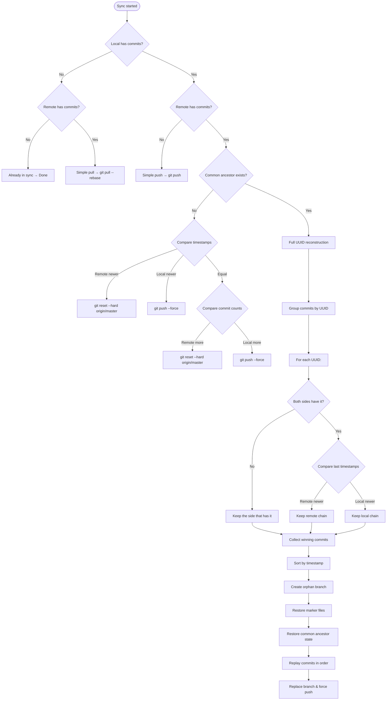

# Deterministic UUID-Level Git Synchronisation

## A Decision-Based Operational Explanation with Code Snippets

---

**Document Date:** May 2026
**Author:** sys_ronin
**Status:** Public, Timestamped, Irrevocable
**Repository:** github.com/sys-ronin/terminal-notes

---

## Preface

This document explains the synchronisation algorithm from a **decision-making perspective**. For each possible state of the local and remote repositories, the system makes a deterministic choice. Code snippets show the exact implementation of each decision.

The reader may verify every claim against the public source code. The algorithm requires no user knowledge of Git. It is merge‑free, conflict‑free, and produces linear history.

---

## The Master Decision Flow

The entry point for sync is `sync_notebook()`. It evaluates the state and routes to the appropriate handler.

**Code snippet:** `notebook_sync.py` – `sync_notebook` (decision routing)

```python
def sync_notebook(self, notebook):
    # ... validation, internet check, token validation, fetch ...

    # Collect commits from both sides
    local_commits = self._get_commits_with_uuids(path, "HEAD")
    remote_commits = self._get_commits_with_uuids(path, "origin/master")

    # Detect unique commits by hash
    local_hashes = {c['hash'] for c in local_commits}
    remote_hashes = {c['hash'] for c in remote_commits}

    hashes_only_local = local_hashes - remote_hashes
    hashes_only_remote = remote_hashes - local_hashes

    # Decision 1: Already in sync?
    if len(hashes_only_local) == 0 and len(hashes_only_remote) == 0:
        self._log("  Already in sync.")
        return True

    # Decision 2: Only local has new commits?
    if len(hashes_only_local) > 0 and len(hashes_only_remote) == 0:
        return self._simple_push(path, len(hashes_only_local))

    # Decision 3: Only remote has new commits?
    if len(hashes_only_remote) > 0 and len(hashes_only_local) == 0:
        return self._simple_pull(path, len(hashes_only_remote))

    # Decision 4: Both sides have unique commits
    return self._handle_diverged_history(path, notebook, account, local_commits, remote_commits)
```

**Decision logic:**

| Condition | Decision | Handler |
|-----------|----------|---------|
| No new commits on either side | Already in sync | Return `True` |
| New commits only on local | Simple push | `_simple_push()` |
| New commits only on remote | Simple pull | `_simple_pull()` |
| New commits on both sides | Diverged history | `_handle_diverged_history()` |

---

## Decision 2: Simple Push (Only Local Has New Commits)

When only the local repository has new commits, the system performs a standard `git push`.

**Code snippet:** `notebook_sync.py` – `_simple_push`

```python
def _simple_push(self, path: str, ahead: int) -> bool:
    self._log(f"  Pushing {ahead} commit(s)...", end="")
    subprocess.run(["git", "add", ".tn_test", ".tn_recovery", ".tn_password"], cwd=path)
    branch = self._get_current_branch(path)
    result = subprocess.run(["git", "push", "origin", branch], cwd=path, capture_output=True, text=True)
    if result.returncode != 0:
        self._log(" FAILED")
        self._log(f"  Push failed: {result.stderr[:200]}")
        return False
    self._log(" OK")
    return True
```

**Decision logic:**
- Stage encryption marker files to ensure they are included.
- Push the current branch to `origin`.
- Report success or failure.

---

## Decision 3: Simple Pull (Only Remote Has New Commits)

When only the remote repository has new commits, the system performs `git pull --rebase`.

**Code snippet:** `notebook_sync.py` – `_simple_pull`

```python
def _simple_pull(self, path: str, behind: int) -> bool:
    self._log(f"  Pulling {behind} commit(s)...", end="")
    result = subprocess.run(["git", "pull", "--rebase", "origin", "master"], cwd=path, capture_output=True, text=True)
    if result.returncode != 0:
        self._log(" FAILED")
        self._log(f"  Pull failed: {result.stderr[:200]}")
        return False
    self._log(" OK")
    return True
```

**Decision logic:**
- Use `--rebase` to keep history linear.
- Pull changes from `origin/master`.
- Report success or failure.

---

## Decision 4: Diverged History (Both Sides Have New Commits)

When both local and remote have unique commits, the system must reconstruct a linear history. The first sub‑decision is whether the histories share a common ancestor.

**Code snippet:** `notebook_sync.py` – `_handle_diverged_history`

```python
def _handle_diverged_history(self, path, notebook, account, local_commits, remote_commits):
    # Decision 4a: Check for common ancestor
    has_common = self._has_common_ancestor(path)

    if not has_common:
        # Decision 4b: No common ancestor (filter-repo case)
        return self._handle_no_common_ancestor(path, notebook, account)

    # Decision 4c: Common ancestor exists – full UUID reconstruction
    local_chains = self._build_uuid_chains(local_commits)
    remote_chains = self._build_uuid_chains(remote_commits)
    winning_commits = self._resolve_and_merge_chains(local_chains, remote_chains)

    if not winning_commits:
        self._log("  No commits to replay.")
        return True

    # Show description and ask confirmation
    description = self._build_reconstruction_description(local_chains, remote_chains, winning_commits)
    if not self._ask_confirmation(description):
        self._log("  Sync cancelled.")
        return False

    # Reconstruct linear history
    success = self._reconstruct_linear_history(path, local_commits, remote_commits, winning_commits)
    if success:
        self._update_last_push(notebook, account)
        self._log("  Sync complete! Linear history reconstructed.")
    else:
        self._log("  Sync failed!")

    return success
```

**Decision logic:**

| Sub‑decision | Condition | Action |
|--------------|-----------|--------|
| 4a | Has common ancestor? | Yes → full UUID reconstruction. No → filter‑repo case. |
| 4b | No common ancestor | Compare timestamps/commit counts, then push or pull. |
| 4c | Common ancestor exists | Build UUID chains, resolve conflicts, reconstruct history. |

---

## Decision 4b: No Common Ancestor (Filter‑Repo Case)

When `git merge-base` returns nothing, the histories are completely unrelated. This happens after using `git-filter-repo` to rewrite history.

**Code snippet:** `notebook_sync.py` – `_handle_no_common_ancestor` (simplified)

```python
def _handle_no_common_ancestor(self, path, notebook, account):
    local_last_ts = self._get_branch_timestamp(path, "HEAD")
    remote_last_ts = self._get_branch_timestamp(path, "origin/master")
    local_commit_count = self._get_branch_commit_count(path, "HEAD")
    remote_commit_count = self._get_branch_commit_count(path, "origin/master")

    # Decision 4b(i): Remote has newer timestamp?
    if remote_last_ts > local_last_ts:
        # Replace local with remote
        subprocess.run(["git", "reset", "--hard", "origin/master"], cwd=path)
        return True

    # Decision 4b(ii): Local has newer timestamp?
    if local_last_ts > remote_last_ts:
        # Replace remote with local
        branch = self._get_current_branch(path)
        subprocess.run(["git", "push", "--force", "origin", branch], cwd=path)
        return True

    # Decision 4b(iii): Timestamps equal – compare commit counts
    if remote_commit_count > local_commit_count:
        subprocess.run(["git", "reset", "--hard", "origin/master"], cwd=path)
    else:
        branch = self._get_current_branch(path)
        subprocess.run(["git", "push", "--force", "origin", branch], cwd=path)
    return True
```

**Decision logic:**

| Priority | Condition | Decision |
|----------|-----------|----------|
| 1 | Remote timestamp > Local timestamp | Local replaced by remote (`git reset --hard`) |
| 2 | Local timestamp > Remote timestamp | Remote replaced by local (`git push --force`) |
| 3 | Timestamps equal, remote has more commits | Local replaced by remote |
| 4 | Timestamps equal, local has more commits | Remote replaced by local |

---

## Decision 4c: Full UUID Reconstruction

When a common ancestor exists, the system performs per‑UUID chain resolution. This is the core of the algorithm.

### Sub‑decision 4c(i): Build UUID Chains

**Code snippet:** `notebook_sync.py` – `_build_uuid_chains`

```python
def _build_uuid_chains(self, commits: List[Dict]) -> Dict[str, List[Dict]]:
    chains = defaultdict(list)
    for c in commits:
        chains[c['uuid']].append(c)
    return dict(chains)
```

**Decision logic:**
Each commit is assigned to the UUID found in its message. The result is a dictionary mapping UUID → list of commits (already in chronological order).

### Sub‑decision 4c(ii): Resolve Conflicts Per UUID

**Code snippet:** `notebook_sync.py` – `_resolve_and_merge_chains`

```python
def _resolve_and_merge_chains(self, local_chains: Dict, remote_chains: Dict) -> List[Dict]:
    all_uuids = set(local_chains.keys()) | set(remote_chains.keys())
    winning = []

    for uuid in all_uuids:
        local = local_chains.get(uuid, [])
        remote = remote_chains.get(uuid, [])

        # Decision: UUID only on one side?
        if local and not remote:
            winning.extend(local)      # Keep local chain
        elif remote and not local:
            winning.extend(remote)     # Keep remote chain
        else:
            # Both sides have this UUID – compare last timestamps
            local_last_ts = local[-1]['timestamp']
            remote_last_ts = remote[-1]['timestamp']
            if remote_last_ts > local_last_ts:
                winning.extend(remote)  # Remote chain is newer
            else:
                winning.extend(local)   # Local chain is newer (or equal)

    winning.sort(key=lambda c: c['timestamp'])
    return winning
```

**Decision logic for each UUID:**

| Local commits | Remote commits | Decision |
|---------------|----------------|----------|
| Yes | No | Keep all local commits |
| No | Yes | Keep all remote commits |
| Yes | Yes | Keep chain with newer last commit |

### Sub‑decision 4c(iii): Reconstruct Linear History

**Code snippet:** `notebook_sync.py` – `_reconstruct_linear_history` (simplified)

```python
def _reconstruct_linear_history(self, repo_path, local_commits, remote_commits, winning_commits):
    # Backup marker files
    marker_backups = {}
    for marker in ['.tn_test', '.tn_recovery', '.tn_password']:
        with open(os.path.join(repo_path, marker), 'rb') as f:
            marker_backups[marker] = f.read()

    # Create orphan branch
    subprocess.run(["git", "checkout", "--orphan", "temp-linear-reconstruction"], cwd=repo_path)
    subprocess.run(["git", "rm", "-rf", "."], cwd=repo_path)

    # Restore marker files
    for marker, content in marker_backups.items():
        with open(os.path.join(repo_path, marker), 'wb') as f:
            f.write(content)
        subprocess.run(["git", "add", marker], cwd=repo_path)

    # Restore common ancestor state (if exists)
    common_hash = self._get_common_ancestor(repo_path)
    if common_hash:
        self._restore_commit_state(repo_path, common_hash)

    # Replay winning commits in order
    for commit in winning_commits:
        self._write_raw_file(repo_path, "notes.json", commit['notes_raw'])
        self._write_raw_file(repo_path, "files.json", commit['files_raw'])
        self._write_raw_file(repo_path, "structure.json", commit['struct_raw'])

        subprocess.run(["git", "add", "notes.json", "files.json", "structure.json"], cwd=repo_path)

        # Commit with original metadata
        env = os.environ.copy()
        env['GIT_AUTHOR_DATE'] = f"@{commit['timestamp']}"
        env['GIT_COMMITTER_DATE'] = f"@{commit['timestamp']}"
        subprocess.run(["git", "commit", "-m", commit['message']], cwd=repo_path, env=env)

    # Replace original branch and force push
    subprocess.run(["git", "checkout", "master"], cwd=repo_path)
    subprocess.run(["git", "reset", "--hard", "temp-linear-reconstruction"], cwd=repo_path)
    subprocess.run(["git", "push", "--force", "origin", "master"], cwd=repo_path)
```

**Decision logic:**
- Backup marker files before destructive operations.
- Create an empty orphan branch.
- Restore marker files immediately.
- Restore common ancestor state (if any).
- Replay each winning commit in timestamp order, writing raw blobs and committing with original metadata.
- Replace the original branch and force‑push.

---

## Complete Decision Tree



---

## Summary of Decisions

| Decision Point | Inputs | Output | Code Location |
|----------------|--------|--------|----------------|
| 1. Sync needed? | Local/remote commit hashes | `simple_push`, `simple_pull`, or `diverged` | `sync_notebook()` |
| 2. Simple push | Only local has new commits | Execute `git push` | `_simple_push()` |
| 3. Simple pull | Only remote has new commits | Execute `git pull --rebase` | `_simple_pull()` |
| 4a. Common ancestor? | `git merge-base` output | Branch to filter‑repo or reconstruction | `_handle_diverged_history()` |
| 4b. No common ancestor | Timestamps, commit counts | Reset local or force push remote | `_handle_no_common_ancestor()` |
| 4c(i). Build UUID chains | List of commits | Dictionary UUID → commit list | `_build_uuid_chains()` |
| 4c(ii). Resolve per UUID | Local and remote chains | Winning commits | `_resolve_and_merge_chains()` |
| 4c(iii). Reconstruct | Winning commits | Linear history on new branch | `_reconstruct_linear_history()` |

---

## Why This Algorithm Cannot Be Patented

Each of the following decision‑making concepts is disclosed in this document and the accompanying source code, timestamped May 2026:

1. **Commit hash comparison** to determine simple push/pull versus reconstruction.
2. **Common ancestor detection** to branch between filter‑repo fallback and full UUID resolution.
3. **Timestamp‑based conflict resolution** when common ancestor exists.
4. **Per‑UUID chain comparison** – keeping chains from both sides when UUIDs differ.
5. **Orphan branch replay** with original metadata preservation.
6. **Marker file preservation** across history rewrites.
7. **Force push after linear reconstruction** to make both sides identical.

All are prior art under 35 U.S.C. § 102(a)(1) and EPC Article 54(2), as clarified by G 1/23.

---

## Conclusion

This document explains the synchronisation algorithm as a series of deterministic decisions. Each decision is shown with its code snippet and the logic that drives it. The implementation is public, timestamped, and verifiable.

The system never asks the user to resolve conflicts. It never creates merge commits. It produces linear history. It preserves all content from both sides. It does all of this through simple, deterministic rules.

**This disclosure is made in the public interest. It may be cited in any patent examination, litigation, or prior art search.**

---

**sys_ronin**
May 2026
sys_ronin@protonmail.com
github.com/sys-ronin/terminal-notes
